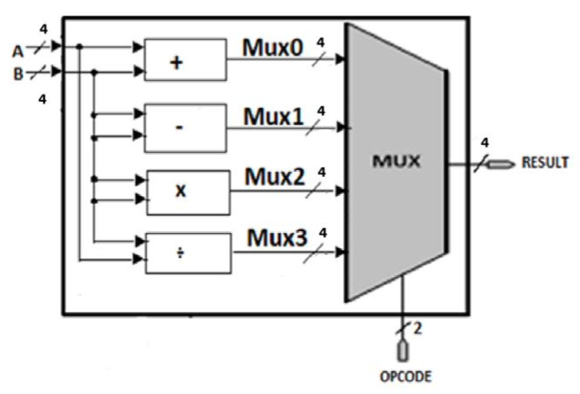
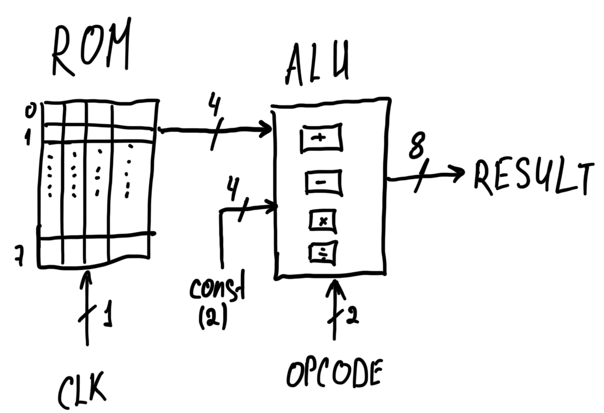

# FPGA ALU with ROM Extension

Individual project.  
Designed and implemented an FPGA-based Arithmetic Logic Unit (ALU) using VHDL.  
The project consists of two parts: a standalone ALU and an extended ROM-driven design.

---

## Overview
- **Skills Developed:** RTL design in VHDL, use of sequential statements (if & case), and testbench-based verification with waveform analysis.
- **Features:**  
  1. 4-bit ALU supporting addition, subtraction, multiplication, and division.  
  2. Warning logic for overflow, negative results, and division by zero.  
  3. Extended version includes ROM-driven inputs and controlled operation sequencing.
- **Technology:** Xilinx Vivado, Zybo Z7 (Zynq-7000), Zynq Processing System (ARM Cortex-A9), LEDs.
- **Simulation:** Functional verification performed using VHDL testbenches and waveform analysis.
- **Language:** VHDL

---

# Stage 1 (ALU)
**Full description:** [Overview_1](docs/part1/overview1.md)

## Photo Demonstration

## Video Demonstration
Full action of system: [▶ Watch on YouTube](https://youtu.be/rUrP-NYsiso)

## Additional Resources
- **Vivado files:** [Alu_project](vivado_project/alu(1st))
- **Code explanation:** [Code](docs/part1/code.md)
- **Simulation results:** [Testbench](docs/part1/result.md)
- **Possible improvements:**  
  1. Upgrade the ALU datapath from 4-bit to 8-bit (scalable operand/result width)  
  2. Replace the single warning LED with separate status flags per operation (e.g. ADD overflow, SUB negative, MUL overflow, DIV-by-zero)  
  3. Add support for signed arithmetic (two’s complement)  
  4. Support fractional division results using fixed-point representation

---

# Stage 2 (ROM modification)
**Full description:** [Overview_2](docs/part2/overview2.md)

## Photo Demonstration

## Video Demonstration
Full action of system: [▶ Watch on YouTube](https://youtu.be/LHuU9mW1duI)

## Additional Resources
- **Vivado files:** [Clk_ARM_based](vivado_project/alu_rom(2nd))
- **Code explanation:** [Code](docs/part2/code2.md)
- **Simulation results:** [Testbench](docs/part2/result2.md)
- **Possible improvements:**  
  1. PS-controlled operand and opcode configuration via AXI interface  
  2. Expansion of ROM size and support for programmable data patterns  
  3. Hardware–software synchronisation and status reporting (PS - PL)

---

## Future Improvements
