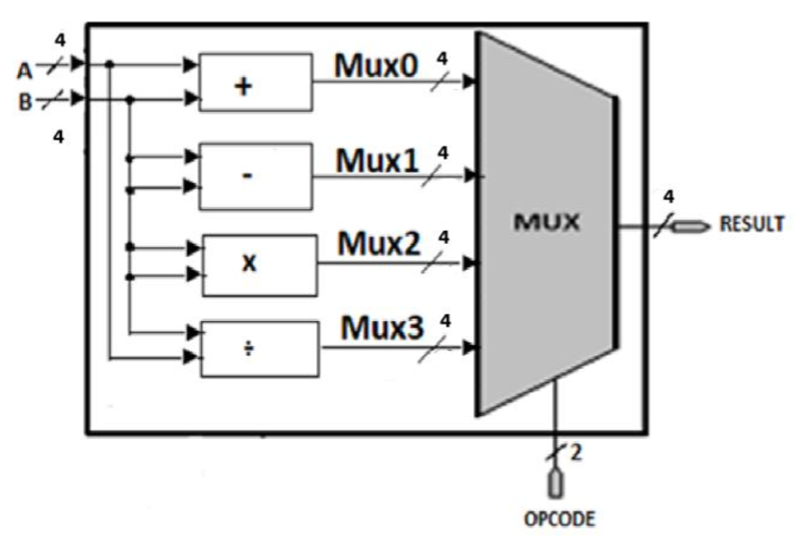
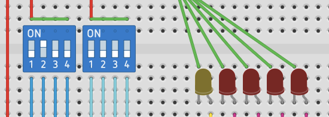

## ALU overview

This segment of the project aims to implement a standalone Arithmetic Logic Unit (ALU) on an FPGA.
An Arithmetic Logic Unit (ALU) is a basic digital component that is used for the execution of basic arithmetic operations on binary numbers.

In this project, the Arithmetic Logic Unit will be able to execute the basic arithmetic operations such as addition, subtraction, multiplication, and division.
The desired arithmetic operation to be executed by the Arithmetic Logic Unit will be chosen by the user with the help of a separate switch.

---

## Input and output configuration

The Arithmetic Logic Unit will be able to execute arithmetic operations on two independent 4-bit input buses.
Both inputs will be unsigned binary numbers, and they will be connected to the system through external switches connected to the pmods pins of the Zybo Z7 board.

The output of the arithmetic operation will also be a 4-bit output.
This output will be shown in the form of four red LEDs, which represent the binary output directly.

In addition to the output of the arithmetic operation, there will be a separate yellow warning LED.
This LED will be separate from the red LEDs and will be used for the purpose of warning during the execution of the arithmetic operation.

---

## Edge cases and warning indication

The warning LED will be asserted in case the ALU encounters an edge case that cannot be directly represented by the output of the 4-bit result.

The edge cases include arithmetic overflow, negative numbers, and division by zero.
When the warning LED is asserted, it implies that the result shown should be interpreted in conjunction with the warning LED in order to understand the result of the operation.

This ensures that the behavior of the ALU is transparent to the user.
