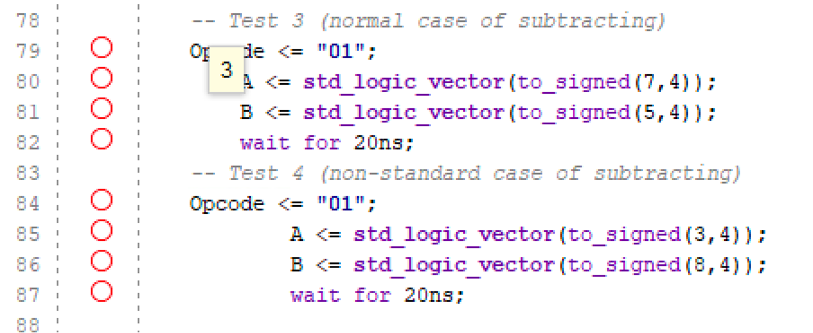
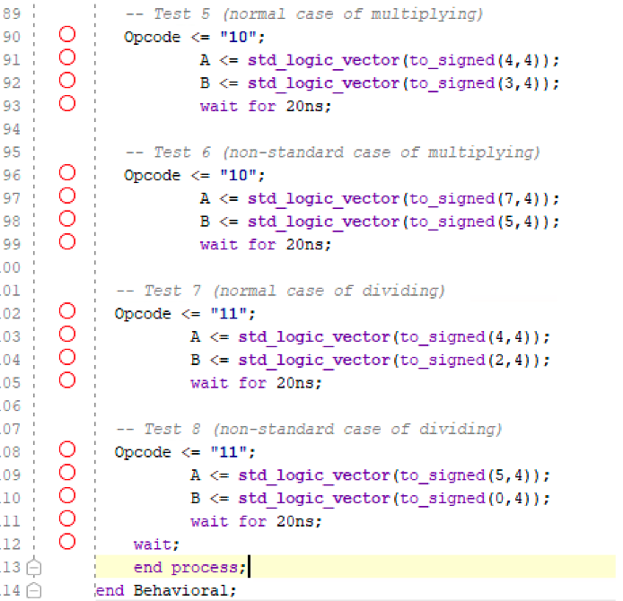
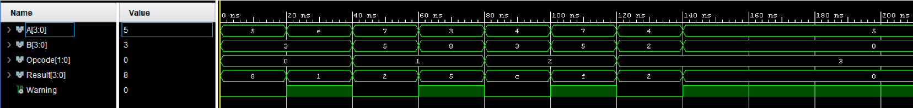

## Addition Test

In all testbench scenarios, each arithmetic operation is checked with two cases: one normal and one non-standard (edge) case.

In the above example, the addition arithmetic operation is checked (OPCODE = 00).
In the first test, the values of the input operands are set as follows: A = 5 and B = 3. This gives us the valid output 8.
This is the normal case for the ALU.

In the second test, the values of the input operands are set as follows: A = 14 and B = 3. This gives us an output greater than 4 bits, which is the non-standard case.

---

## Subtraction Test

For the subtraction operation, OPCODE = 01 is used.
As with other operations, two cases are considered: a normal case and a non-standard case.

For the first test, input values A = 7 and B = 5 are used. The input values are integers and are converted to 4-bit std_logic_vector signals, representing the main signal types used within the ALU block. The subtraction operation has a valid positive result and does not produce a warning indication.

For the second test, input values A = 3 and B = 8 are used. The operation has a negative arithmetic value. The output is the absolute value of the subtraction, and the warning signal is asserted as a non-standard case.

---

## Other Tests

The remaining testbench scenarios are similar in terms of their verification strategy.

In the case of the multiplication operation, where OPCODE = 10, two cases are considered. In one case, values for operands are chosen such that the result falls within the 4-bit output range without any overflow. In another case, larger values are chosen for operands that result in overflow, which is indicated by the warning signal.

In the case of the division operation, where OPCODE = 11, first a normal case is considered, where the divisor is non-zero and an integer result is obtained. Next, a non-standard case is considered, where division by zero occurs. In this case, the result is set to zero and the warning signal is asserted.

---

## Waveform Results

The Vivado simulators generate waveforms that confirm that the ALU block is functioning as desired. All arithmetic operations function as desired, including normal and edge cases, and the warning signal operates as desired for each edge case.

