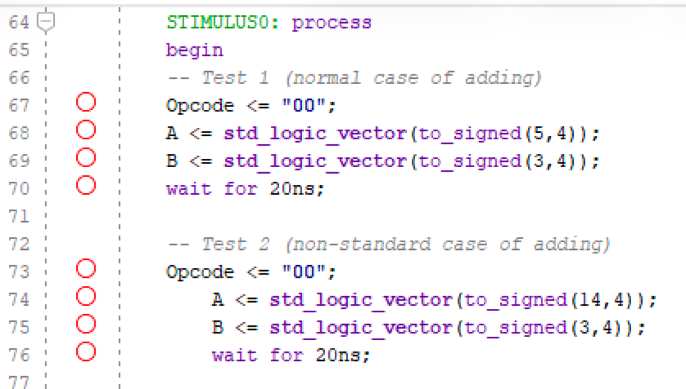

## Addition Test

In all testbench scenarios, each arithmetic operation is checked with two cases: one normal and one non-standard (edge) case.

In the above example, the addition arithmetic operation is checked (OPCODE = 00).
In the first test, the values of the input operands are set as follows: A = 5 and B = 3. This gives us the valid output 8.
This is the normal case for the ALU.

In the second test, the values of the input operands are set as follows: A = 14 and B = 3. This gives us an output greater than 4 bits, which is the non-standard case.

