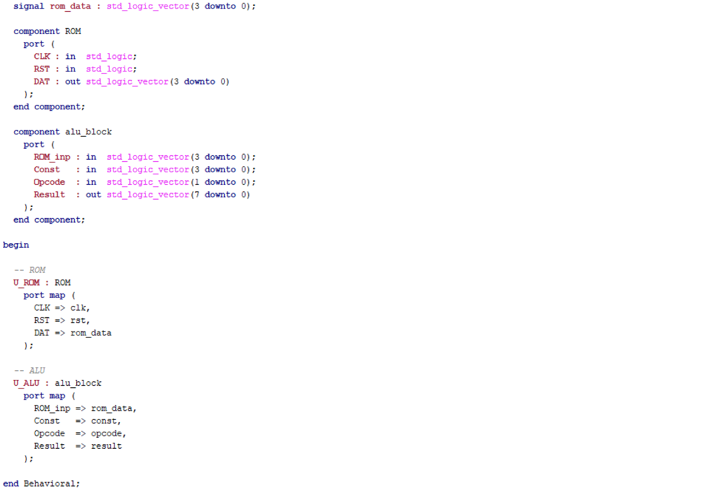
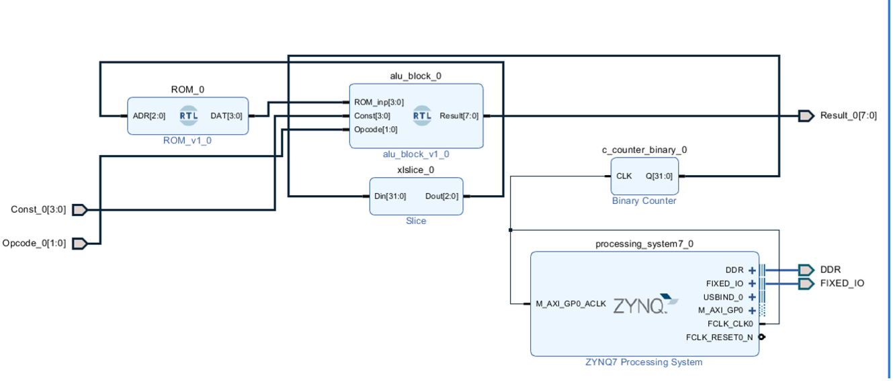

## Introduction

For the implementation of the entire ROM-ALU processing chain, the design was broken down into several VHDL design sources, each of which handled a particular functional unit. It was necessary to have design sources for the ROM alone and for the ALU alone so that the functionality of the ROM and the ALU was retained strictly distinct. Once the design sources were individually verified, they were incorporated into a master design source.

---

## Architecture of ROM

In this code, an array is initially defined ranging from address 0 to 7, thus forming eight ROM locations. Every location holds a predefined 4-bit number, which ranges only over the even numbers used in the design. 

Next, an internal signal is declared, which acts as a counter, keeping record of the current location of the ROM. 

Finally, a clock process is used, meaning that the code will be executed whenever there is a change in the clock signal. On every rising edge of the clock, the data stored at that particular location, identified by the counter, is given to the output. Once the data is read, the counter is incremented by one, meaning that the next location of the ROM will be accessed on the next rising edge of the clock.

---

## Architecture of ALU

The code for the ALU used in this design is similar to the code for the `Stage 1`, with only minor variations. However, the difference lies in the fact that two internal signals are added in order to extend the ALU input, i.e. the ROM output signal and the constant signal, both of which are extended from 4-bit values to 8-bit values. The extended signals are used for performing all the arithmetic operations performed within the ALU. 

The use of a process with a case statement helps identify the operation depending on the opcode, thus facilitating the processes of addition, subtraction, multiplication, and division. The calculations of these operations are performed using the extended 8-bit values, and the result is stored within the output.

---

## Approaches of uniting blocks

There are multiple ways to integrate the ROM and ALU blocks into a single system:  
the 1st one is based on component instantiation, while the 2nd one relies on IP-blocks integration through Vivado Block Design.

### 1. RTL-level component integration

The first approach is implemented by creating a top-level design source, where both the ROM and ALU are instantiated as VHDL components.

In the code, the ROM and the ALU components are initially declared along with their input and output ports. The ROM is instantiated with the clock and reset connected to their inputs, and the data output of the ROM assigned to an internal signal. This internal signal is later used as the input for the ALU instantiation. By using port mapping, the output of the ROM is connected directly to the input of the ALU, hence the ROM data is processed by the ALU within the complete system.

### 2. IP-based system integration

The ROM and ALU components were instantiated as separate IP modules using the Vivado Block Design environment.

The components were connected through graphic integration alongside the ZYNQ Processing System, which provides clocking and system-level control signals. To facilitate the clock generation, a digital counter was added as a new IP module that was connected to the ROM input. As far as ROM module is concerned, instead of the internal ROM counter, the address is supplied through the use of an input signal that gets the clock value. 

The clock is provided by the ZYNQ Processing System, which is fed into the programmable logic. This clock is thereafter sent to a binary counter IP block, which produces a 32-bit output signal. A slice block is used to truncate the signal to 3 bits, picking the most significant bits in order to get the lowest possible rate of switching. The truncated signal is sent to the ROM address input.

