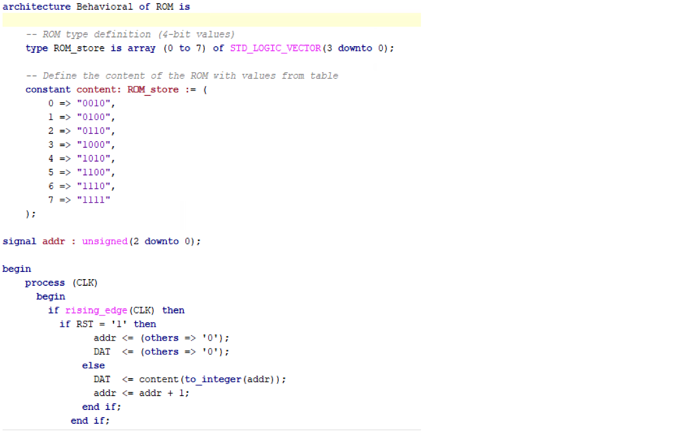
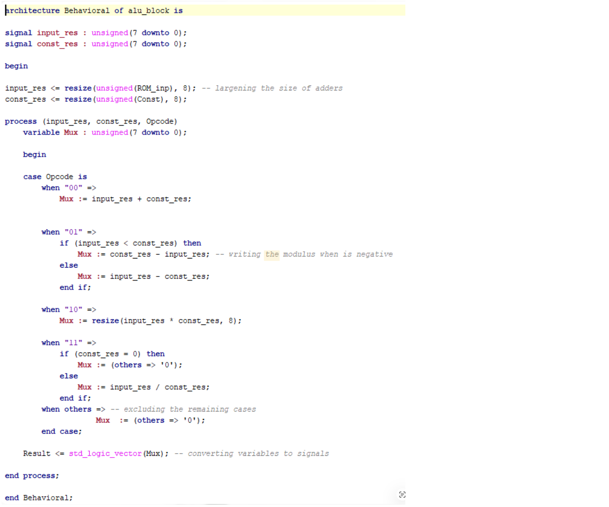

## Introduction

For the implementation of the entire ROM-ALU processing chain, the design was broken down into several VHDL design sources, each of which handled a particular functional unit. It was necessary to have design sources for the ROM alone and for the ALU alone so that the functionality of the ROM and the ALU was retained strictly distinct. Once the design sources were individually verified, they were incorporated into a master design source.

---

## Architecture of ROM

In this code, an array is initially defined ranging from address 0 to 7, thus forming eight ROM locations. Every location holds a predefined 4-bit number, which ranges only over the even numbers used in the design. 

Next, an internal signal is declared, which acts as a counter, keeping record of the current location of the ROM. 

Finally, a clock process is used, meaning that the code will be executed whenever there is a change in the clock signal. On every rising edge of the clock, the data stored at that particular location, identified by the counter, is given to the output. Once the data is read, the counter is incremented by one, meaning that the next location of the ROM will be accessed on the next rising edge of the clock.

---

## Architecture of ALU

The code for the ALU used in this design is similar to the code for the `Stage 1`, with only minor variations. However, the difference lies in the fact that two internal signals are added in order to extend the ALU input, i.e. the ROM output signal and the constant signal, both of which are extended from 4-bit values to 8-bit values. The extended signals are used for performing all the arithmetic operations performed within the ALU. 

The use of a process with a case statement helps identify the operation depending on the opcode, thus facilitating the processes of addition, subtraction, multiplication, and division. The calculations of these operations are performed using the extended 8-bit values, and the result is stored within the output.

---

## Approaches of uniting blocks

